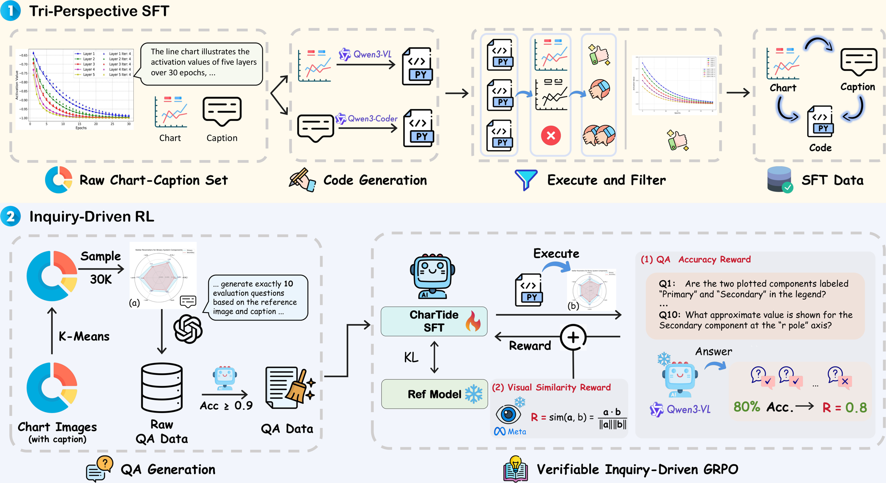
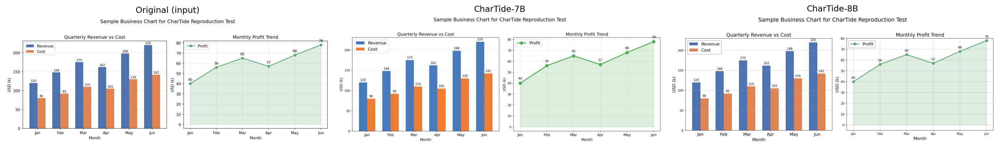

<div align="center">
  <h1>CharTide: Data-Centric Chart-to-Code Generation via Tri-Perspective Tuning and Inquiry-Driven Evolution </h1>
  
</div>


<div align="center">
<a href='https://arxiv.org/abs/2604.22192'></a>&ensp;<a href='https://huggingface.co/collections/Fengx1nn/chartide'></a>&ensp;<a href='https://github.com/Shopee-MUG/CharTide/blob/main/LICENSE'></a>

Xiangxi Zheng<sup>1</sup>, Kuang He<sup>2</sup>, Jiayi Hu<sup>3</sup>, Ping Yu<sup>1</sup>, Rui Yan<sup>4</sup>, Yuan Yao<sup>1†</sup>, Peng Hou<sup>2</sup>, Anxiang Zeng<sup>2</sup>, Alex Jinpeng Wang<sup>5†</sup>
</div>
<div align="center">
<strong><sup>1</sup>Nanjing University &nbsp; <sup>2</sup>LLM Team, Shopee Pte. Ltd. &nbsp; <sup>3</sup>East China Normal University</strong>
</div>
<div align="center">
<strong><sup>4</sup>Nanjing University of Science and Technology &nbsp; <sup>5</sup>Central South University</strong>
</div>
<div align="center">
† Corresponding Authors
</div>


---
**CharTide** is a **data-centric** framework that systematically redesigns both training and alignment data for chart-to-code generation. Existing approaches are fundamentally constrained by data-centric limitations: simply scaling homogeneous chart-code pairs conflates visual perception with program logic, preventing models from fully leveraging the richness of multimodal supervision. To break this bottleneck, CharTide introduces (i) a **Tri-Perspective Tuning** strategy that explicitly decouples training into visual perception, pure-text code logic, and modality fusion streams, yielding a 2M-sample dataset that enables a 7B model to surpass specialized baselines using only supervised data; and (ii) an **Inquiry-Driven RL** framework grounded in the principle of information invariance, where a frozen Inspector objectively verifies generated charts through atomic QA tasks to provide verifiable, low-variance reward signals. Experiments on ChartMimic, Plot2Code, and ChartX show that **CharTide-7B/8B** significantly outperforms open-source baselines, surpasses GPT-4o, and is competitive with GPT-5.

<div align="center">

</div>


## 📢 News and Updates

* ```2026.04.15``` We upload our model weights [CharTide-7B](https://huggingface.co/Fengx1nn/CharTide-7B) and [CharTide-8B](https://huggingface.co/Fengx1nn/CharTide-8B) to HuggingFace.
* ```2026.04.07``` 🎉 Our **CharTide** is accepted by **ACL 2026 Main**!


## 🤗 Models
| Model | Backbone | Download Link |
| ---- | ---- | ---- |
| CharTide-7B | Qwen2.5-VL-7B-Instruct | [Fengx1nn/CharTide-7B](https://huggingface.co/Fengx1nn/CharTide-7B) |
| CharTide-8B | Qwen3-VL-8B-Instruct | [Fengx1nn/CharTide-8B](https://huggingface.co/Fengx1nn/CharTide-8B) |


## 📊 Performance
We compare CharTide against proprietary and open-source models on **ChartMimic**, **Plot2Code**, and **ChartX**. *For Plot2Code we replace the GPT-4V evaluator with GPT-4o and report normalized scores over the full test set to avoid survivorship bias (see paper Appendix for details).* In each column **bold** marks the best open-source result and <u>underline</u> marks the second-best.

<table>
<thead>
  <tr>
    <th rowspan="2">Model</th>
    <th colspan="3">ChartMimic</th>
    <th colspan="3">Plot2Code*</th>
    <th>ChartX</th>
  </tr>
  <tr>
    <th>Exec.Rate</th>
    <th>Low-Level</th>
    <th>High-Level</th>
    <th>Exec.Rate</th>
    <th>Text Match</th>
    <th>Rating</th>
    <th>GPT score</th>
  </tr>
</thead>
<tbody>
  <tr>
    <td colspan="8"><i>Proprietary</i></td>
  </tr>
  <tr>
    <td>GPT-4o</td>
    <td>94.7</td><td>80.0</td><td>87.7</td>
    <td>87.1</td><td>52.6</td><td>5.66</td>
    <td>2.61</td>
  </tr>
  <tr>
    <td>GPT-5</td>
    <td>96.8</td><td>82.1</td><td>94.7</td>
    <td>87.8</td><td>61.9</td><td>7.28</td>
    <td>3.59</td>
  </tr>
  <tr>
    <td>Gemini-2.5-Pro</td>
    <td>94.7</td><td>79.2</td><td>92.5</td>
    <td>88.6</td><td>69.1</td><td>7.45</td>
    <td>3.27</td>
  </tr>
  <tr>
    <td colspan="8"><i>Open-Source General-Domain</i></td>
  </tr>
  <tr>
    <td>Qwen2.5-VL-7B</td>
    <td>75.0</td><td>49.0</td><td>51.8</td>
    <td>68.9</td><td>33.7</td><td>3.04</td>
    <td>2.74</td>
  </tr>
  <tr>
    <td>Qwen2.5-VL-72B</td>
    <td>75.3</td><td>51.9</td><td>56.6</td>
    <td>59.3</td><td>33.2</td><td>3.61</td>
    <td>2.85</td>
  </tr>
  <tr>
    <td>Qwen3-VL-8B</td>
    <td>81.7</td><td>63.7</td><td>71.5</td>
    <td>76.5</td><td>36.3</td><td>3.91</td>
    <td>2.93</td>
  </tr>
  <tr>
    <td>Qwen3-VL-30B-A3B</td>
    <td>85.2</td><td>67.7</td><td>76.5</td>
    <td>87.1</td><td>46.7</td><td>4.85</td>
    <td>2.73</td>
  </tr>
  <tr>
    <td>Qwen3-VL-235B-A22B</td>
    <td>93.3</td><td>76.8</td><td>87.6</td>
    <td>84.8</td><td>46.2</td><td>5.19</td>
    <td><b>3.35</b></td>
  </tr>
  <tr>
    <td colspan="8"><i>Open-Source Chart-Domain</i></td>
  </tr>
  <tr>
    <td>ChartCoder-7B</td>
    <td>89.5</td><td>72.1</td><td>78.5</td>
    <td>68.9</td><td>31.1</td><td>2.73</td>
    <td>2.79</td>
  </tr>
  <tr>
    <td>ChartMaster-7B</td>
    <td>93.5</td><td>77.1</td><td>83.3</td>
    <td><u>89.4</u></td><td>53.6</td><td>4.73</td>
    <td>2.82</td>
  </tr>
  <tr>
    <td>MSRL-7B-SFT</td>
    <td>92.6</td><td>71.2</td><td>82.8</td>
    <td>77.3</td><td>34.7</td><td>3.71</td>
    <td>3.19</td>
  </tr>
  <tr>
    <td>MSRL-7B</td>
    <td>94.3</td><td>76.1</td><td>87.4</td>
    <td>62.9</td><td>31.9</td><td>3.24</td>
    <td>3.22</td>
  </tr>
  <tr>
    <td>VinciCoder-7B</td>
    <td>91.2</td><td>77.0</td><td>83.4</td>
    <td>68.9</td><td>33.6</td><td>3.39</td>
    <td>3.18</td>
  </tr>
  <tr>
    <td>VinciCoder-8B</td>
    <td>90.2</td><td>75.8</td><td>81.4</td>
    <td>85.6</td><td>49.8</td><td>4.49</td>
    <td>3.21</td>
  </tr>
  <tr>
    <td><b>CharTide-7B-SFT</b></td>
    <td>94.3</td><td>79.3</td><td>86.4</td>
    <td>88.6</td><td>58.2</td><td>5.17</td>
    <td>3.00</td>
  </tr>
  <tr>
    <td><b>CharTide-7B</b></td>
    <td><u>96.7</u></td><td><u>81.7</u></td><td><u>91.6</u></td>
    <td><u>89.4</u></td><td><u>59.6</u></td><td><u>5.60</u></td>
    <td>3.22</td>
  </tr>
  <tr>
    <td><b>CharTide-8B-SFT</b></td>
    <td>93.7</td><td>80.9</td><td>89.4</td>
    <td>86.4</td><td>58.1</td><td>5.46</td>
    <td>3.19</td>
  </tr>
  <tr>
    <td><b>CharTide-8B</b></td>
    <td><b>97.3</b></td><td><b>83.0</b></td><td><b>92.7</b></td>
    <td><b>91.7</b></td><td><b>64.6</b></td><td><b>5.93</b></td>
    <td><u>3.23</u></td>
  </tr>
</tbody>
</table>


## 🔍 Usage Example

> **Versions**: `transformers>=4.57`, `qwen-vl-utils==0.0.10` for CharTide-7B; `qwen-vl-utils>=0.0.11` for CharTide-8B (Qwen3-VL backbone).

### CharTide-7B (Qwen2.5-VL backbone)
```python
import re
import torch
from transformers import AutoProcessor, Qwen2_5_VLForConditionalGeneration
from qwen_vl_utils import process_vision_info  # qwen-vl-utils==0.0.10

model_path = "Fengx1nn/CharTide-7B"

model = Qwen2_5_VLForConditionalGeneration.from_pretrained(
    model_path,
    torch_dtype=torch.bfloat16,
    device_map="cuda",
    attn_implementation="sdpa",
)
processor = AutoProcessor.from_pretrained(
    model_path,
    min_pixels=256 * 28 * 28,
    max_pixels=1280 * 28 * 28,
)

instruction = (
    "You are an expert Python developer who specializes in writing matplotlib code "
    "based on a given picture. I found a very nice picture in a STEM paper, but there "
    "is no corresponding source code available. I need your help to generate the "
    "Python code that can reproduce the picture based on the picture I provide.\n"
    "Now, please give me the matplotlib code that reproduces the picture below, "
    "starting with \"```python\" and ending with \"```\"."
)

messages = [{
    "role": "user",
    "content": [
        {"type": "image", "image": "assets/example_input.png"},
        {"type": "text", "text": instruction},
    ],
}]

text = processor.apply_chat_template(messages, tokenize=False, add_generation_prompt=True)
images, videos = process_vision_info(messages)
inputs = processor(text=[text], images=images, videos=videos, padding=True, return_tensors="pt").to(model.device)

with torch.inference_mode():
    generated_ids = model.generate(**inputs, max_new_tokens=4096, do_sample=False)
generated_ids = [o[len(i):] for i, o in zip(inputs.input_ids, generated_ids)]
output = processor.tokenizer.batch_decode(generated_ids, skip_special_tokens=True, clean_up_tokenization_spaces=False)[0]

m = re.search(r"```python\s*(.*?)```", output, re.DOTALL)
generated_code = m.group(1) if m else output
print(generated_code)
```

### CharTide-8B (Qwen3-VL backbone)
The 8B model uses a different model class (`Qwen3VLForConditionalGeneration`) and a newer `qwen-vl-utils`. Everything else is identical to the 7B example above.

```python
# pip install -U "qwen-vl-utils>=0.0.11"   # required for Qwen3-VL
import torch
from transformers import AutoProcessor, Qwen3VLForConditionalGeneration
from qwen_vl_utils import process_vision_info

model_path = "Fengx1nn/CharTide-8B"

model = Qwen3VLForConditionalGeneration.from_pretrained(
    model_path,
    torch_dtype=torch.bfloat16,
    device_map="cuda",
    attn_implementation="sdpa",
)
processor = AutoProcessor.from_pretrained(
    model_path,
    min_pixels=256 * 28 * 28,
    max_pixels=1280 * 28 * 28,
)
# ... same `messages` / `apply_chat_template` / `generate` as the 7B example
```

### Reproduction example
The left chart is the user-provided input, the middle and right are rendered from the matplotlib code produced by CharTide-7B and CharTide-8B respectively.

<div align="center">

</div>


## 📖 Citation
If you find this project useful, please feel free to leave a star and cite our paper:
```
@misc{zheng2026chartidedatacentriccharttocodegeneration,
      title={CharTide: Data-Centric Chart-to-Code Generation via Tri-Perspective Tuning and Inquiry-Driven Evolution}, 
      author={Xiangxi Zheng and Kuang He and Jiayi Hu and Ping Yu and Rui Yan and Yuan Yao and Peng Hou and Anxiang Zeng and Alex Jinpeng Wang},
      year={2026},
      eprint={2604.22192},
      archivePrefix={arXiv},
      primaryClass={cs.CV},
      url={https://arxiv.org/abs/2604.22192}, 
}
```
